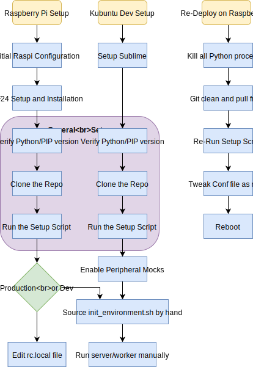

# SmartHome System
Run your home from a Raspberry Pi! Specifically your gardening system and your ambient lights.



## Raspberry Pi Setup
### Notes
* The following steps are written for a Raspberry Pi 2 with a TP-Link Wifi Adapter (RTL8188EUS).
* My LAN router has been configured to recognise the MAC address of the Wi-Fi Adapter and associate it with the `__HOSTNAME_SERVER__` hostname and a fixed IP address.

### Steps
1. Download Raspbian Buster Lite and image it onto an SD Card.
2. Boot Up the Raspberry Pi. Log in with `pi`/`raspberry`.
3. Configure the RPi with `$ sudo raspi-config`:
    * Hostname:
        * Set to something memorable.
    * Password
        * Set to something else that isn't 'raspberry'.
    * Localization Options
        * Timezone: Set
        * Keyboard Layout: US, if you can figure out how to set it.
    * Network Options
        * Hostname: YOUR_HOSTNAME_GOES_HERE
    * Interfacing Options
        * SSH Server: Enable
4. Set Up RPi Wi-Fi to talk to my network.
    * Create a file called `/etc/network/interfaces.d/tplink` with the following lines:
        ```
        auto wlan0
        allow-hotplug wlan0
        iface wlan0 inet manual
        wpa-conf /etc/wpa_supplicant/wpa_supplicant.conf
        ```
    * Edit the file `/etc/wpa_supplicant/wpa_supplicant.conf` so that it reads as follows:
        ```
        ctrl_interface=DIR=/var/run/wpa_supplicant GROUP=netdev
        update_config=1
        country=US

        network={
            scan_ssid=1
            ssid="__WIFI_NETWORK_NAME__"
            psk="__WIFI_NETWORK_PASSWORD__"
        }
        ```
    * Reboot.
5. Install git with `$ sudo apt install git`.
6. Install the RF24 Module as described in the 'RF24 Setup' section.
7. Execute the 'Common Setup Steps'.
8. After running the setup script for the SmartHome project, have a look at the `dist.pth` file nested
   in the `virtualenv` directory and just sanity check that the files listed in there actually exist. If they don't, your RF24 libraries won't work unless you fix this:
    * look around in `/usr/local/lib/` for something related to `RF24<something something>.egg`.
    * update the `dist.pth` file and the setup script to point to the right library locations.
9. Power off the system. Connect any peripherals as required, and start the Pi.
10. Enable any mocks you will need, and practise running the server as root with
    ```
    /home/pi/SmartHome/scripts/start_system_in_background.sh
    ```
    Ensure that you can access the server and things work as expected.
11. If the Pi is intended for production use, modify your `/etc/rc.local` file by adding the following line before
   the exit command. This will enable the server and worker automatically on startup.
    ```
    /home/pi/SmartHome/scripts/start_system_in_background.sh
    ```
   (Double check that the path is correct, depending on where you cloned the repo).

## PC Setup
To get this going on your laptop, all you have to do is run the Common Setup steps. There may be an issue where 
you don't have the RPi python library installed. So just modify the `main.conf` file to enable the mockout. It's
also recommended that you have a solid IDE like Sublime Text ready to go to make some tidy code edits.

## Common Setup
### Dependencies
* Python 3.6+
* Pip3 (via the python3-pip package)
    * If you run `$ pip3 --version` you should see 3-point-something.

### Steps
1. Clone the repository.
    ```
    $ cd ~/Development
    $ git clone ssh://git@__HOSTNAME_LOCAL_GIT_SERVER__/home/git/SmartHome.git
    ```
2. Ensure your Python versions and PIP versions are set up.
3. Run the setup script
    ```
    $ ./scripts/setup_dev_environment.sh
    ```

## RF24 Setup
These steps are based on the Detailed Tutorial on Confluence "Tutorial - RPi + Arduino Hello World", which
were modified from the original steps at http://tmrh20.github.io/RF24/Python.html.

1. On the Raspberry Pi, enable SPI through `raspi-config`. Reboot.
2. Update your software (this might take a while)
    ```
    $ sudo apt update
    $ sudo apt upgrade
    ```
3. Install requisite software.
    ```
    $ sudo apt install python3-dev libboost-python-dev
    ```
4. Get the driver software on your Raspberry Pi.
    ```
    $ git clone https://github.com/nRF24/RF24.git
    ```
5. Change into the driver directory, build, and install the driver.
    ```
    $ cd RF24
    $ make
    $ sudo make install
6. Change into the pyRF24 library, install the setup tools dependency, and build the Python wrapper.
    ```
    $ cd pyRF24
    $ sudo apt install python3-setuptools
    $ python3 setup.py build
    $ sudo python3 setup.py install
    ```

## Normal Development
For use in a non-production environment. Before beginning, enable any mockouts in the `main.conf`
file if you think you need them.
1. After logging in, source the initialization script.
    ```
    $ source init_environment.sh
    ```
2. Change directory into the `app` directory and run the system.
    ```
    $ cd app
    $ ./run_system.py
    ```
Exit the application with Ctrl-C or run `$ killall python`.

## Re-Deployment
1. Deactivate any running systems with
    ```
    # killall python
    # killall python3
    # deactivate
    ```
2. Pull from master.
    ```
    $ git pull origin master
    ```
3. Run a git clean.
    ```
    $ git clean -dxf
    ```
4. Re-Deploy the repo.
    ```
    $ cd scripts
    $ ./setup_dev_environment.sh
    ```
5. Ideally, your default config file will already be set up for a production
   system. But, if you require a non-standard configuration, copy over another main.conf from the template
   and make any changes as necessary.
6. Reboot. Your changes should work.

## Hot Fix to Database
1. Deactivate any running systems with
    ```
    # killall python
    # killall python3
    # deactivate
    ```
2. Pull from master.
    ```
    $ git pull origin master
    ```
3. Update database by modifying `scripts/re_initialize_database.py`.
4. Delete the existing database
    ```
    $ rm db/system.db
    ```
5. Re-Deploy Database.
    ```
    $ . init_environment.sh
    $ ./scripts/re_initialize_database.py
    ```
6. Deactivate environment with `deactivate` and then start the system.
    ```
    $ sudo ./scripts/start_system_in_background.sh
    ```
7. Log out. Server should continue running.
